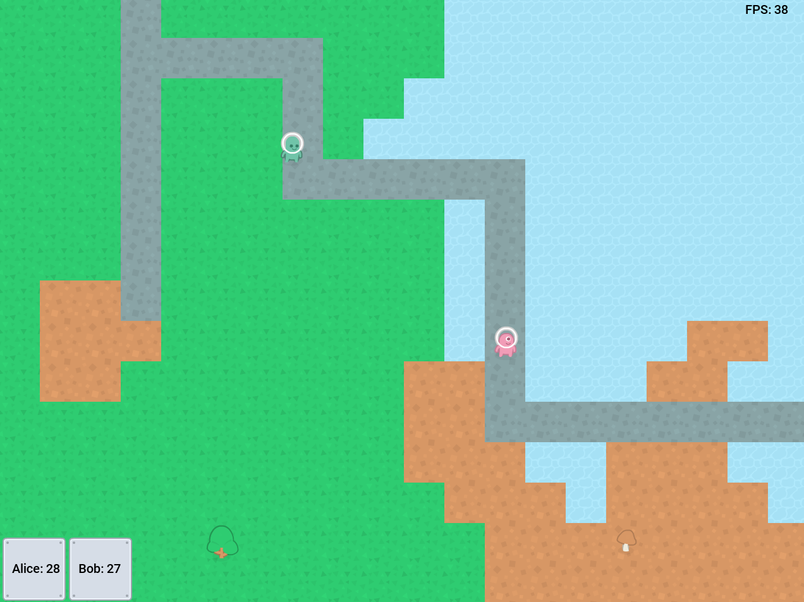

# rl-vista

PyGame visualizer for Reinforcement Learning

## Run

````
PYTHONPATH=. poetry run python examples/movements/main.py
poetry run python examples/movements/main.py
````

## Usage

1. Create event System: rlv.core.System
1. Register all components
1. Register engine (see main/Application.__init__)
1. Create map (basically array of images)
1. Create objects (entities with images)
1. Create actors
1. Order ^ is important, the objects created first, will be rendered first,
   i.e. behind the objects created last.
1. Run the main loop (Engine.get().__next__ or for _ in Engine.get())

That's all



